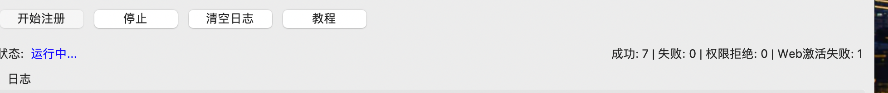

<div align="center">

# Grok Registration Protocol CPA

**支持 GUI 与命令行的 Grok 账号批量注册及 CPA 认证导出工具**

[](https://www.python.org/)
[](https://docs.astral.sh/uv/)


[主要功能](#-主要功能) · [快速开始](#-快速开始) · [运行方式](#-运行方式) · [常见问题](#-常见问题) · [加入交流群](https://t.me/+VWfAKGZZGyw3NDA1)

</div>

> [!TIP]
> 💬 感兴趣的朋友欢迎加入 [Telegram 交流群](https://t.me/+VWfAKGZZGyw3NDA1)，一起交流、折腾和完善项目。

注册完成后，工具会自动完成 Grok Web 首次激活、账号可用性检查，并按配置导出账号与 CPA 认证文件。不可用账号不会写入结果；在有限任务中，工具可以自动补号。

## ✨ 主要功能

- 支持 Hotmail / Outlook、CustomMail 及项目已有邮箱通道
- 支持单个或批量注册，可断点续跑
- 注册后自动完成 Grok Web 首次激活
- 自动检查账号是否可用
- 可导出 CPA 认证文件
- 本地和远程 grok2api 自动入池默认关闭

## 📊 运行效果

下面是一次实际运行的结果示例：成功 7 个、注册失败 0 个、权限拒绝 0 个，Web 激活失败 1 个。

<p align="center">
  
</p>

> 实际成功率会受到邮箱质量、代理网络、风控策略及运行环境等因素影响。

## 🧰 环境要求

- macOS 或带桌面环境的 Linux
- Python 3.13
- `uv`
- Google Chrome 或 Chromium
- 可访问 xAI 服务的代理

## 🚀 快速开始

安装依赖：

```bash
uv sync
```

复制配置：

```bash
cp config.example.json config.json
```

编辑 `config.json`，至少确认以下内容：

```json
{
  "email_provider": "hotmail",
  "proxy": "http://127.0.0.1:7890",
  "cpa_proxy": "http://127.0.0.1:7890"
}
```

### Hotmail / Outlook

```bash
cp mail_credentials.example.txt mail_credentials.txt
```

每行填写一个邮箱：

```text
邮箱----密码----ClientID----RefreshToken
```

并在 `config.json` 中设置：

```json
{
  "email_provider": "hotmail"
}
```

### CustomMail

适用于自有域名邮件转发到 Gmail 的场景：

```bash
cp custom_mail_credentials.example.txt custom_mail_credentials.txt
```

每行填写一条路由：

```text
自有域名----Gmail收件箱----Gmail应用专用密码
```

并在 `config.json` 中设置：

```json
{
  "email_provider": "custommail"
}
```

## ▶️ 运行方式

命令行注册 1 个账号：

```bash
uv run python -u register_cli.py --extra 1 --threads 1
```

批量注册：

```bash
uv run python -u register_cli.py --extra 5 --threads 2
```

启动 GUI：

```bash
uv run python grok_register_ttk.py
```

查看全部命令行参数：

```bash
uv run python register_cli.py --help
```

## 📦 输出文件

| 文件 | 内容 |
|---|---|
| `accounts_cli.txt` | CLI 注册成功的账号 |
| `accounts_*.txt` | GUI 注册成功的账号 |
| `cpa_auths/xai-*.json` | CPA 认证文件 |
| `cpa_auths/registration_health_audit.jsonl` | 不含账号密钥的检查记录 |

账号文件格式：

```text
email----password----sso
```

## ⚙️ 常用配置

| 配置项 | 说明 |
|---|---|
| `email_provider` | 邮箱类型 |
| `proxy` | 注册和邮箱代理 |
| `cpa_proxy` | CPA 导出代理，留空时使用 `proxy` |
| `register_count` | GUI 目标账号数 |
| `register_threads` | GUI 注册并发数 |
| `cpa_export_enabled` | 是否导出 CPA 认证文件 |
| `registration_health_check_enabled` | 是否检查新账号可用性 |
| `cpa_required_referrer` | 最终 CPA token 必须携带的 referrer，默认 `grok-build`；空字符串可关闭严格策略 |
| `cpa_auth_code_require_referrer` | 旧版兼容开关；仅在缺少 `cpa_required_referrer` 时生效 |
| `proxy_rotation_enabled` | 是否通过 Clash controller 按账号轮换美国出口；开启后强制串行 |

其余选项直接查看 [`config.example.json`](config.example.json) 中的注释。

## ❓ 常见问题

- 收不到验证码：检查邮箱凭证、转发规则和代理。
- 浏览器无法启动：确认 Chrome / Chromium 已安装，并关闭冲突的调试进程。
- 修改配置未生效：完全退出正在运行的 GUI 后重新启动。
- 账号被检查淘汰：查看 `cpa_auths/registration_health_audit.jsonl`。
- 注册成功但没有 CPA 文件：检查 `cpa_export_enabled` 和运行日志。
- rotation 开启后批次主动停止：检查 controller、代理端口、美国地区探测和通用 403 熔断日志；系统会 fail-closed，避免静默复用被拒出口。

### 相关文档

- [启动说明](STARTUP.md)
- [CustomMail CLI 指南](CUSTOMMAIL_CLI.md)
- [CPA 隔离诊断](DIAGNOSTIC_CLI_PROXY.md)

## 🔒 安全提醒

> [!WARNING]
> `config.json`、邮箱凭证、账号文件、Cookie、Token 和运行记录均包含敏感信息。相关文件已加入 `.gitignore`，请勿手动提交或分享。

请在遵守相关服务条款和当地法律的前提下使用本项目。
